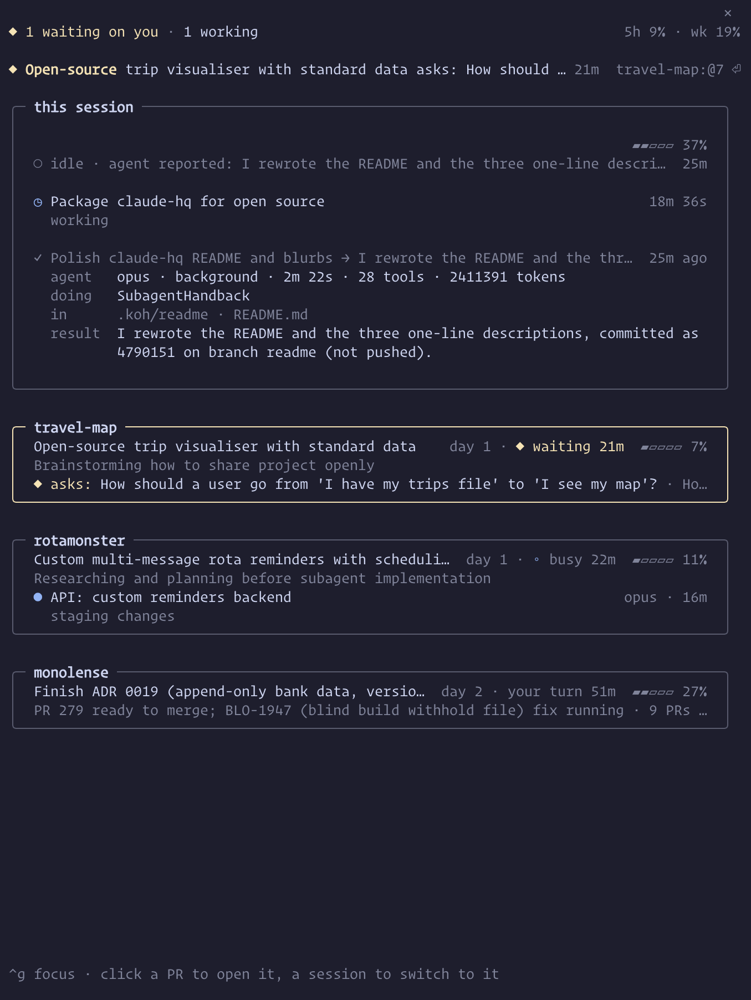

# claude-hq

**One pane for every Claude Code session on your machine, and the one that needs you.**

<p align="center"></p>

## Features

- **A card per session.** Its goal, what it is doing now, its context fill, its agents and its open PRs with CI state.
- **Knows when you're needed.** A permission prompt, a question, or a reply that ends in a question turns the card yellow and sends one desktop notification.
- **One press to get there.** Enter or a click brings the session's terminal forward: its tmux pane, its exact tab in Ghostty, iTerm2, Terminal, WezTerm, kitty, zellij, Supacode or cmux, its VS Code or Cursor window, or a background session. If none can, it copies the resume command.
- **PRs a click away.** Checks bar and merge state per PR, worst first. Click to open it.
- **Wakes on your PRs.** When a PR the session owns goes red, merges, conflicts or falls behind, HQ starts a turn there to deal with it. It never merges or pushes.
- **PR watchers included.** `pr-ci-wait <pr>` and `pr-merge-wait <pr>` land on the Bash tool's PATH for Claude to run in the background.
- **Plan usage and status line.** Your 5-hour and weekly limits in the header; the status line names the session waiting on you.

## Install

```sh
claude plugin marketplace add bshakr/claude-hq
claude plugin install hq@claude-hq
```

Or inside a session: `/plugin marketplace add bshakr/claude-hq`, then `/plugin install hq@claude-hq`. New sessions load it.

Third-party marketplaces do not update by themselves: turn it on under `/plugin` → Marketplaces → claude-hq → Enable auto-update, or run `/hq update` when the pane's header says a new version is out.

To run it from a clone instead:

```sh
git clone https://github.com/bshakr/claude-hq
claude --plugin-dir claude-hq/plugins/hq
```

The pane opens by itself once per session when the terminal is at least 144 columns wide. On a narrower terminal, type `/hq`.

## Requirements

| Tool | Required? | Without it |
| --- | --- | --- |
| Claude Code 2.1.295+ | yes | HQ does not load (the plugin API is early access) |
| `git` | yes | no PRs are tied to a session |
| `gh`, logged in | yes, for PRs | PRs show without titles, checks or merge state; the watchers exit |
| `jq` | recommended | `pr-ci-wait` refuses to run; HQ polls `gh` itself |
| `tmux` | optional | a press uses the terminal app, else copies the resume command |
| `linear` CLI | optional | ticket ids show without a gloss |

Built on macOS. On Linux the pane, tmux jumps and the watchers work; opening a PR and focusing terminal apps use macOS tools. Focusing a Ghostty (1.3 or later), iTerm2 or Terminal tab asks once for Automation permission; until it is granted the press only raises the app.

**Pane sits on a grey or brown block?** Claude Code fills its side panel with the theme's `composerSidebarBackground`. Run `/hq match-bg #1e1e2e` with your terminal background colour: on a custom theme it updates that theme, otherwise it writes `~/.claude/themes/hq-<base>.json` on your current theme, which you pick once in `/theme`. Every open session picks up the change live. Or write the file yourself and pick it:

```json
{
  "name": "hq-dark",
  "base": "dark",
  "overrides": { "composerSidebarBackground": "#1e1e2e" }
}
```

Inside tmux the colour only matches with truecolor on: add `set -ga terminal-overrides ",xterm-ghostty:Tc"` (use your `$TERM`) to `~/.tmux.conf`, set `"CLAUDE_CODE_TMUX_TRUECOLOR": "1"` under `env` in `~/.claude/settings.json`, then detach and reattach.

## Usage

| Command | Does |
| --- | --- |
| `/hq` | open the pane |
| `/hq close` | close it |
| `/hq wake on\|off` | start a turn when an owned PR changes; off sends a toast only |
| `/hq notify on\|off` | desktop notification when another session waits on you |
| `/hq summaries on\|off` | Haiku goal lines and ticket glosses |
| `/hq reset` | drop the three toggles above so settings.json applies again |
| `/hq update` | update HQ from the plugin store; `/reload-plugins` applies it |
| `/hq match-bg <#hex>` | paint Claude Code's side panel your terminal background colour |
| `/hq help` | list the commands |

`ctrl+x tab` moves the keys from the prompt to the pane. In the pane, `j`/`k` or Tab move, Enter or a click opens, Esc goes back to the prompt. For a single chord, bind one in `~/.claude/keybindings.json`:

```json
{ "bindings": [{ "context": "Chat", "bindings": { "ctrl+g": "abovePrompt:focus" } }] }
```

## Configuration

Set options in `/config`, or in `~/.claude/settings.json` (use the key `hq@inline` when running with `--plugin-dir`):

```json
{
  "pluginConfigs": {
    "hq@claude-hq": {
      "options": { "summaries": false, "autoOpen": false, "colorWaiting": "#f9e2af" }
    }
  }
}
```

| Option | Default | Does |
| --- | --- | --- |
| `summaries` | `true` | Haiku goal lines and ticket glosses; off makes no model calls |
| `wake` | `true` | start a turn when an owned PR changes |
| `notify` | `true` | desktop notification when another session waits on you |
| `updateCheck` | `true` | check once a day for a newer HQ and say so in the pane header |
| `autoOpen` | `true` | open the pane once per session (from 144 columns; 110 after you have opened it with `/hq`) |
| `colorBroken`, `colorWaiting`, `colorWorking`, `colorDone`, `colorAccent`, `colorDim` | `ansi256(1)`, `(3)`, `(4)`, `(2)`, `(6)`, `(8)` | colours: `#rrggbb`, `ansi256(N)` or `N` (0-255); defaults follow your terminal theme |

The `/hq` toggles override `wake`, `notify` and `summaries` on one machine until `/hq reset`.

## What it reads and calls

HQ reads Claude Code's local session files under `~/.claude/` and each session writes a short summary of itself to `~/.claude/hq/sessions/` for the others to read. For goal lines and ticket glosses it sends up to 6,000 characters of a session's prompts and titles to Haiku through your own Claude account; set `summaries` to `false` or run `/hq summaries off` to stop all model calls. Once a day HQ fetches its published `plugin.json` from raw.githubusercontent.com to see whether a newer version is out; set `updateCheck` to `false`, or set `CLAUDE_CODE_DISABLE_NONESSENTIAL_TRAFFIC`, to stop it. PR state comes from `gh` (and the watchers' files in `~/.cache/pr-watch/`), ticket titles from `linear` when installed. No telemetry; nothing else leaves your machine.

## Contributing

See [CONTRIBUTING.md](CONTRIBUTING.md) to run it from a clone and run the checks.

Report a security issue privately, as [SECURITY.md](SECURITY.md) describes.

## License

[MIT](LICENSE)
